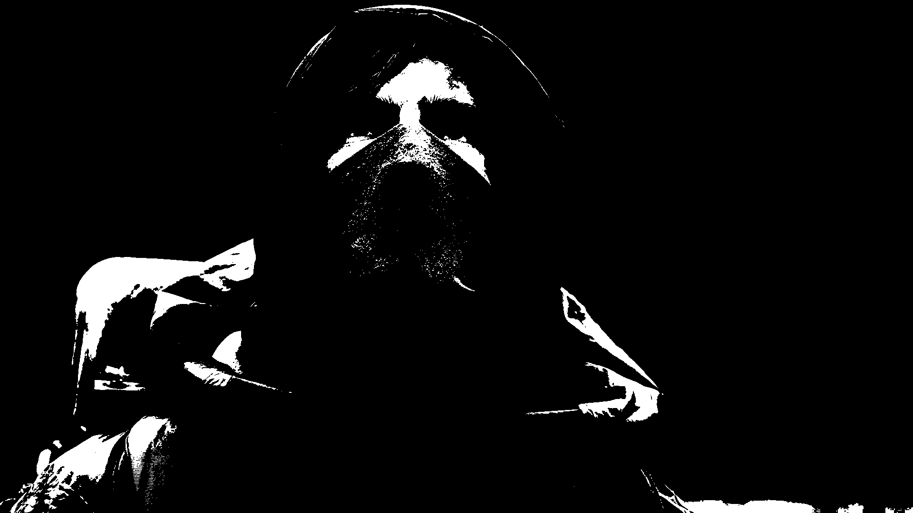

# SimpleDither

This is a project about a simple dither algorithm. We're implementing The Floyd-Steinberg Dithering in Golang.

## Instructions

Just clone the repo and build the program with the command:
```
go build main.go
```

Then you can test the program like this:
```
./main file.jpg
```

The program only accept JPEG file and will store the result in a PNG file.

You can take a look at some examples in Results Folder.

- Original:<br/>
<br/>

- Dithering:<br/>
<br/>

## Authors
* **Martin Siesse** [Msiesse](https://github.com/msiesse)
